# Deep NASDAQ

麻烦试用的朋友们给我点个 ，谢谢大家～ 🥺✨🌟💖

网站地址：[https://deepnasdaq.com/](https://deepnasdaq.com/)

## 尝鲜邀请码

### 可用邀请码

<table border="0">
  <tr>
    <td><code>2G3DJKDW8BJG</code></td>
    <td><code>3DRF6TA7J142</code></td>
    <td><code>0NAFFY75W5C2</code></td>
    <td><code>NYD9VZMYETF9</code></td>
    <td><code>9CS7BC5Y7B1D</code></td>
    <td><code>S6JPFCYPXDNP</code></td>
  </tr>
  <tr>
    <td><code>5GS9TP9H760P</code></td>
    <td><code>B2MWGA1MXJ7C</code></td>
    <td><code>WE544229Q073</code></td>
    <td><code>E9R3BX9MG3ZX</code></td>
    <td><code>MWZMB53MGTCC</code></td>
    <td><code>63YG3T5ERHFN</code></td>
  </tr>
  <tr>
    <td><code>5QJDA7WB950R</code></td>
    <td><code>11H741V033C8</code></td>
    <td><code>DKKF6MYVAAVS</code></td>
    <td><code>EV7JHQCM6XT7</code></td>
    <td><code>PWZTHNCWM1X4</code></td>
    <td><code>CVGBNZWC8MME</code></td>
  </tr>
  <tr>
    <td><code>T3TZ7R0AEWAA</code></td>
    <td><code>Z2JWFSWM8JRK</code></td>
    <td><code>GPWKMXGZ5SW0</code></td>
    <td><code>K8E6P2FCYRTD</code></td>
    <td><code>ZPNP26BNVMW6</code></td>
    <td><code>PEGB2754Y2WB</code></td>
  </tr>
  <tr>
    <td><code>5WBAZ7WDQ2XT</code></td>
    <td><code>8MX2F82C7QB4</code></td>
    <td></td>
    <td></td>
    <td></td>
    <td></td>
  </tr>
</table>

### 旧码（已激活）

<table border="0">
  <tr>
    <td><s><code>XBYW9FTVJF23</code></s></td>
    <td><s><code>GRG6SNMTQ4TR</code></s></td>
    <td><s><code>ZKN9A35B895V</code></s></td>
    <td><s><code>SBT8A120HPSE</code></s></td>
    <td><s><code>B5P1D5ATK6PN</code></s></td>
    <td><s><code>K32SFNB5K1WW</code></s></td>
  </tr>
  <tr>
    <td><s><code>C8J3D03BFXYE</code></s></td>
    <td><s><code>X5QP8QCFSTN9</code></s></td>
    <td><s><code>XVC15C09AYB2</code></s></td>
    <td><s><code>H77W8PFXYRSK</code></s></td>
    <td><s><code>M2M4BPRHA6SH</code></s></td>
    <td><s><code>WJQ1W46WRQ79</code></s></td>
  </tr>
  <tr>
    <td><s><code>YA5BNFCY4132</code></s></td>
    <td><s><code>BR1EJ2GM5APQ</code></s></td>
    <td></td>
    <td></td>
    <td></td>
    <td></td>
  </tr>
</table>

Deep NASDAQ 是一个面向 A 股市场结构观察的可视化看板，覆盖板块资金流、个股确认、热度与调研、题材生命周期、估值位置、相关性网络、板块传染和指数脱锚等界面。

本仓库是公开展示包，只包含网站地址、主要界面的主体截图和各界面的参考文献。仓库不包含应用源码、数据库、凭据、部署脚本、原始数据文件或私有研究模块。

准备过程中已做外部成熟模组调研；公开仓库只列学术论文与安全标准文献，不列实现项目。

## 主体界面截图

### 登录入口

### 市场总览主体

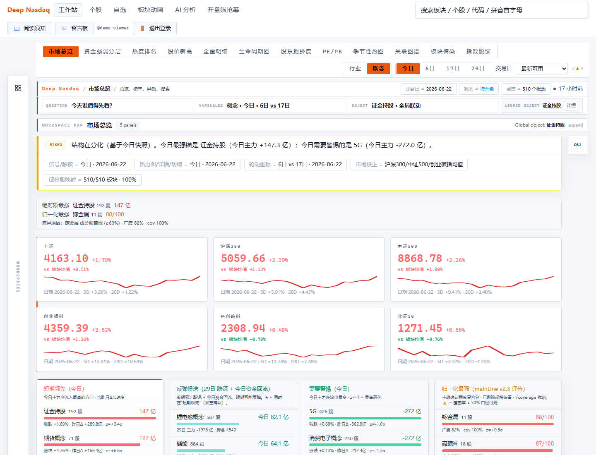

### 资金强弱分层主体

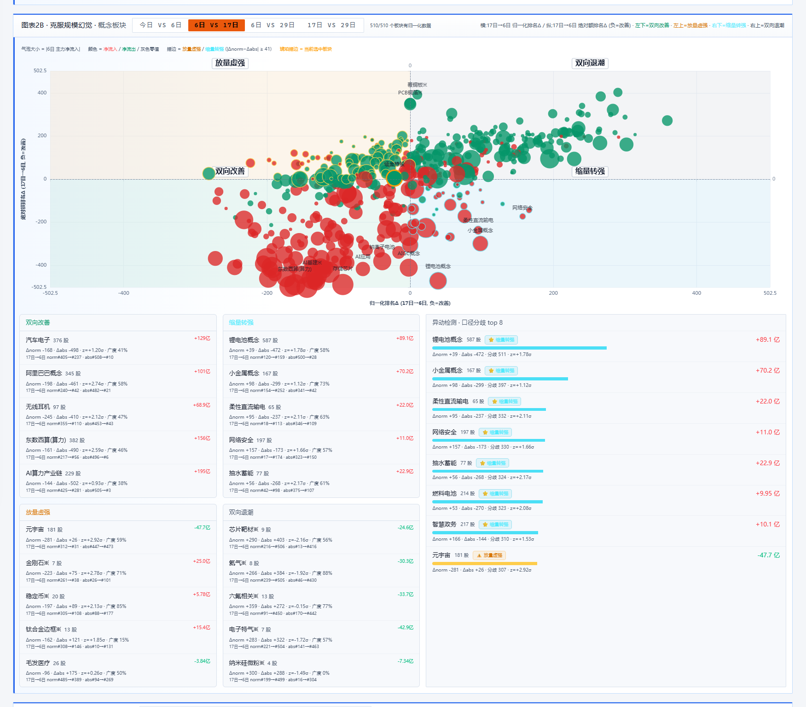

### 热度排名主体

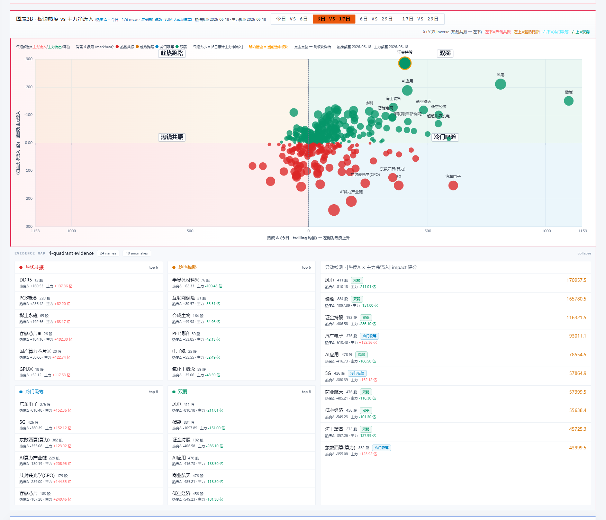

### 股价新高确认主体

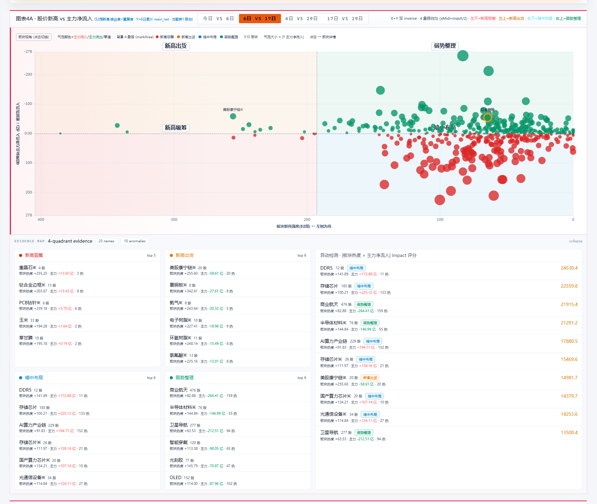

### 全量明细主体

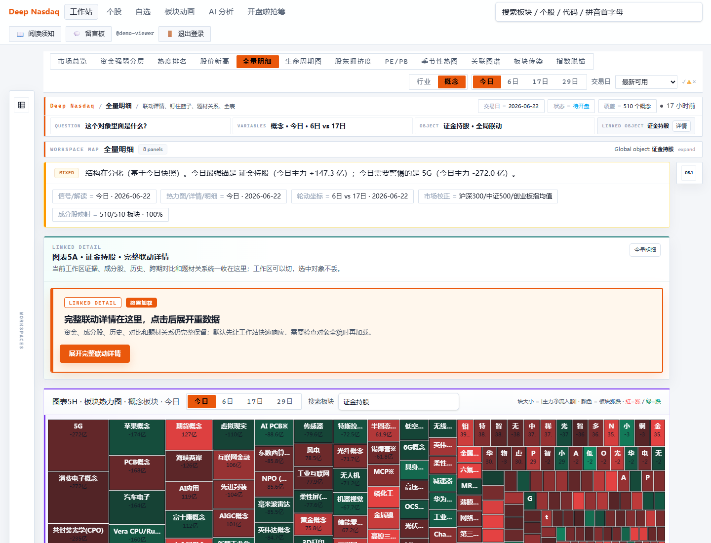

### 题材生命周期主体

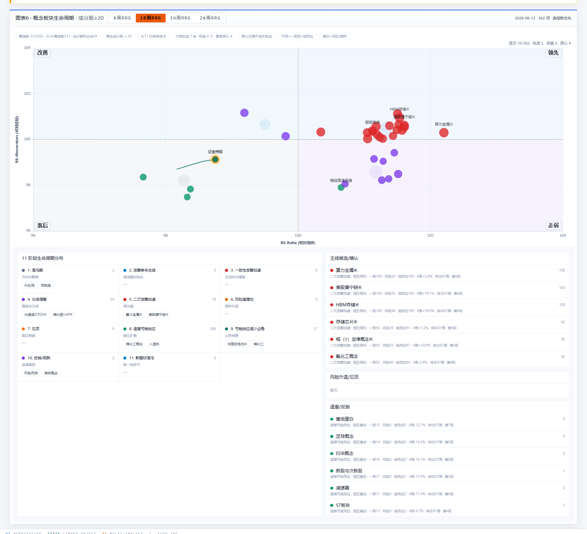

### PE/PB 估值主体

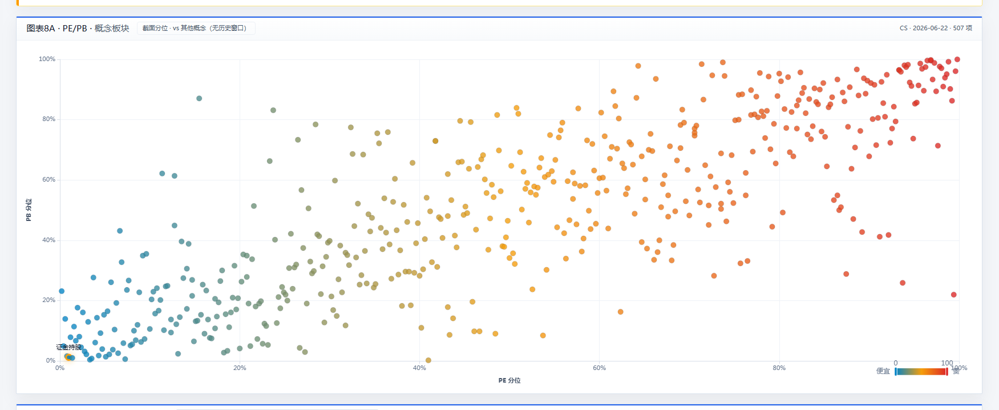

### 股东拥挤度主体

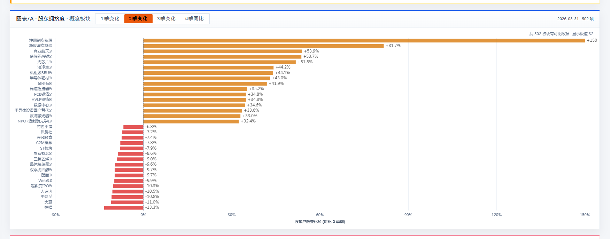

### 季节性热图主体

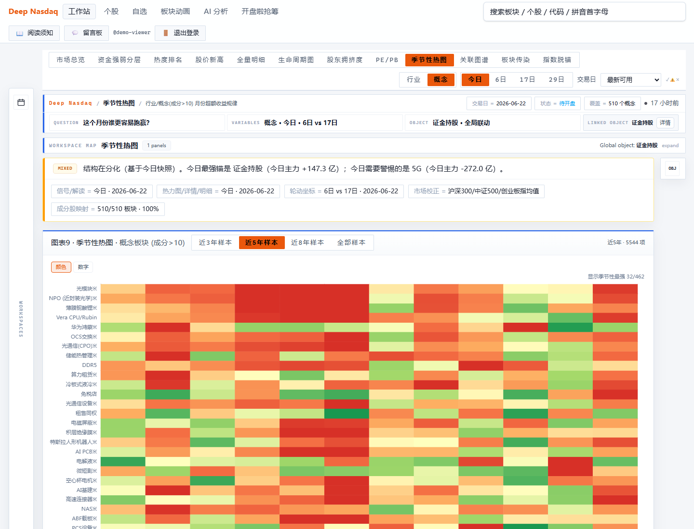

### 关联图谱主体

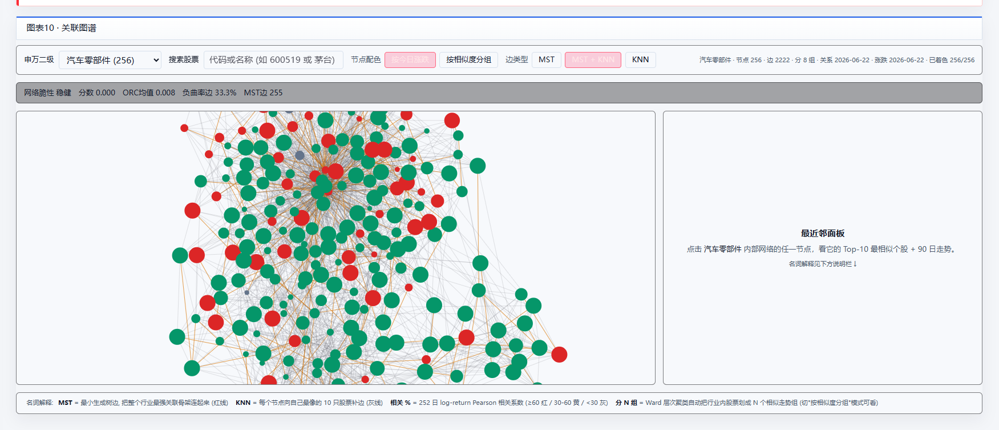

### 板块传染主体

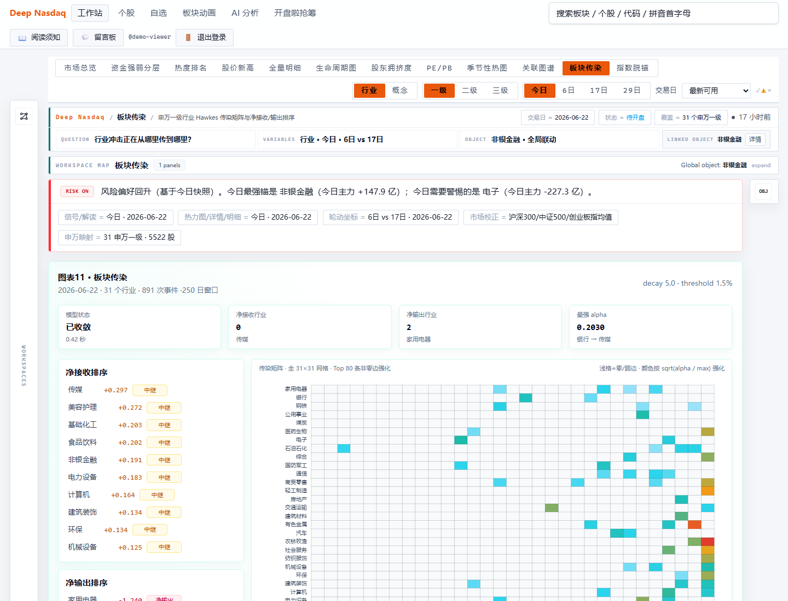

### 指数脱锚主体

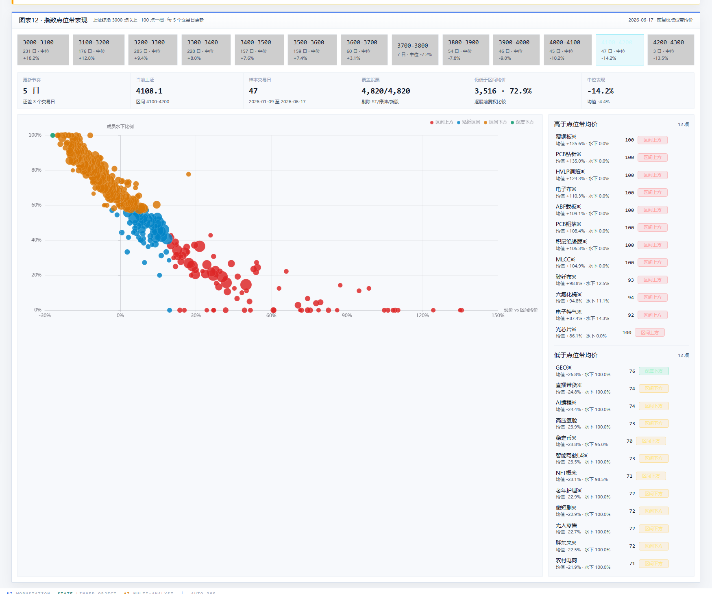

### 个股详情主体

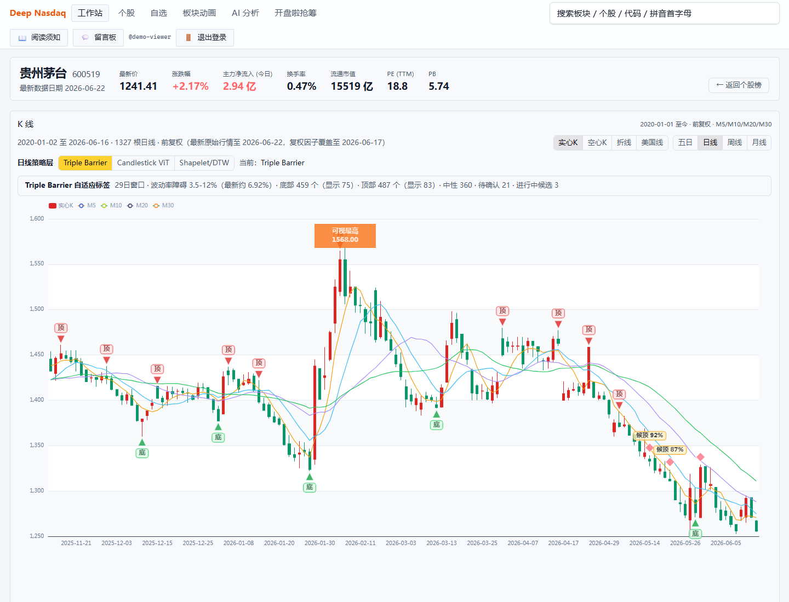

### 概念净流入动画主体

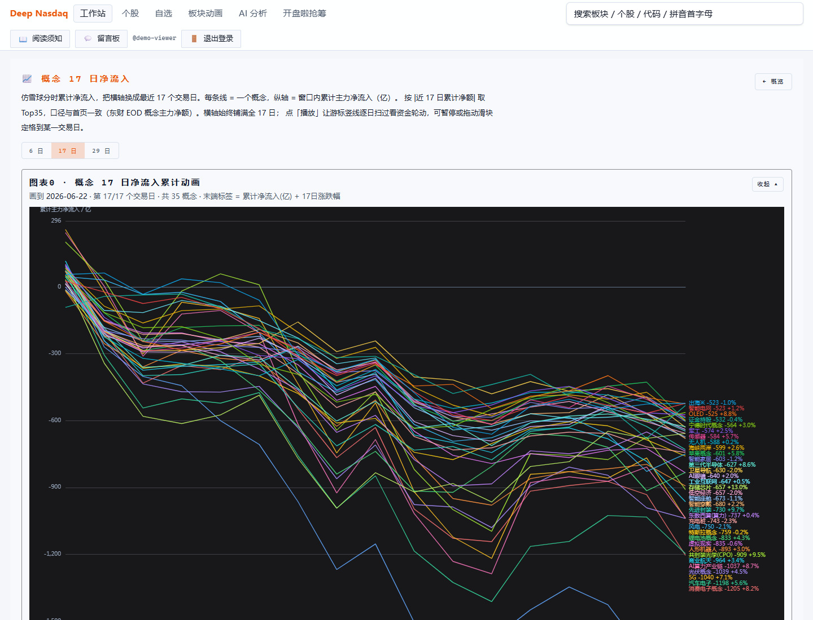

## 参考文献

下表为 2026-06-23 重新检索后的可核验来源，优先采用期刊索引页、NBER、SSRN、arXiv、NIST 与 OWASP 等来源；仅说明界面设计与研究依据，不列实现项目。

| 界面 | 研究依据 | 可核验参考文献 |
| --- | --- | --- |
| 登录入口 | 身份认证、会话生命周期、安全验证基线 | [NIST SP 800-63B-4, Digital Identity Guidelines: Authentication and Authenticator Management](https://csrc.nist.gov/pubs/sp/800/63/b/4/final)；[OWASP Application Security Verification Standard](https://owasp.org/www-project-application-security-verification-standard/) |
| 市场总览主体 | 行业动量、市场横截面、A 股异常检验 | [Moskowitz and Grinblatt, "Do Industries Explain Momentum?", Journal of Finance, 1999](https://ideas.repec.org/a/bla/jfinan/v54y1999i4p1249-1290.html)；[Jegadeesh and Titman, "Returns to Buying Winners and Selling Losers", Journal of Finance, 1993](https://onlinelibrary.wiley.com/doi/abs/10.1111/j.1540-6261.1993.tb04702.x)；[Eun, Huang and Lai, "Anomalies in the China A-share Market", SSRN, 2021](https://papers.ssrn.com/sol3/papers.cfm?abstract_id=3810114) |
| 资金强弱分层主体 | 板块轮动、相对强弱、短期反转、因子解释 | [Yang and Shi, "Sector Rotation by Factor Model and Fundamental Analysis", arXiv:2401.00001](https://arxiv.org/abs/2401.00001)；[Sauer, "Sector Rotation through the Business Cycle: A Machine Learning Regime Approach", SSRN, 2019](https://papers.ssrn.com/sol3/papers.cfm?abstract_id=3473907)；[Sarwar, Mateus and Todorovic, "US sector rotation with five-factor Fama-French alphas", Journal of Asset Management, 2018](https://ideas.repec.org/a/pal/assmgt/v19y2018i2d10.1057_s41260-017-0067-2.html) |
| 热度排名主体 | 投资者注意力、搜索代理变量、分析师覆盖与信息扩散 | [Da, Engelberg and Gao, "In Search of Attention", Journal of Finance, 2011](https://onlinelibrary.wiley.com/doi/10.1111/j.1540-6261.2011.01679.x)；[Hong, Lim and Stein, "Bad News Travels Slowly", Journal of Finance, 2000](https://ideas.repec.org/a/bla/jfinan/v55y2000i1p265-295.html)；[Baidu Index and predictability of Chinese stock returns, Financial Innovation, 2017](https://ideas.repec.org/a/spr/fininn/v3y2017i1d10.1186_s40854-017-0053-1.html) |
| 股价新高确认主体 | 动量确认、52 周新高锚定、技术形态识别 | [George and Hwang, "The 52-Week High and Momentum Investing", Journal of Finance, 2004](https://onlinelibrary.wiley.com/doi/abs/10.1111/j.1540-6261.2004.00695.x)；[Lo, Mamaysky and Wang, "Foundations of Technical Analysis", Journal of Finance, 2000](https://onlinelibrary.wiley.com/doi/abs/10.1111/0022-1082.00265)；[Kusuma et al., "Using Deep Learning Neural Networks and Candlestick Chart Representation to Predict Stock Market", arXiv:1903.12258](https://arxiv.org/abs/1903.12258) |
| 全量明细主体 | 成分横截面、行业动量与个股动量、A 股因子差异 | [Moskowitz and Grinblatt, 1999](https://ideas.repec.org/a/bla/jfinan/v54y1999i4p1249-1290.html)；[Jegadeesh and Titman, 1993](https://onlinelibrary.wiley.com/doi/abs/10.1111/j.1540-6261.1993.tb04702.x)；[Anomalies in the China A-share Market, SSRN](https://papers.ssrn.com/sol3/papers.cfm?abstract_id=3810114) |
| 题材生命周期主体 | 相对强弱象限、轮动阶段、市场网络结构 | [Yang and Shi, arXiv:2401.00001](https://arxiv.org/abs/2401.00001)；[Daniel and Moskowitz, "Momentum Crashes", NBER Working Paper 20439](https://www.nber.org/papers/w20439)；[Leibon et al., "Topological structures in the equities market network", arXiv:0805.3470](https://arxiv.org/abs/0805.3470) |
| PE/PB 估值主体 | 估值比率、价值与成长、价值/动量共同结构 | [Fama and French, "The Anatomy of Value and Growth Stock Returns", Financial Analysts Journal, 2007](https://papers.ssrn.com/sol3/papers.cfm?abstract_id=1071124)；[Asness, Moskowitz and Pedersen, "Value and Momentum Everywhere", Journal of Finance, 2013](https://papers.ssrn.com/sol3/papers.cfm?abstract_id=2174501)；[Yang and Shi, 2024](https://arxiv.org/abs/2401.00001) |
| 股东拥挤度主体 | 持有人广度、投资者基础、拥挤交易与未来收益 | [Chen, Hong and Stein, "Breadth of Ownership and Stock Returns", Journal of Financial Economics, 2002](https://www.nber.org/papers/w8151)；[Chen, Hong and Stein, SSRN version](https://papers.ssrn.com/sol3/papers.cfm?abstract_id=262106)；[Anomalies in Chinese A-Shares, SSRN, 2017](https://papers.ssrn.com/sol3/papers.cfm?abstract_id=2955144) |
| 季节性热图主体 | 日历效应、同月收益季节性、信息周期 | [Heston and Sadka, "Seasonality in the cross-section of stock returns", Journal of Financial Economics, 2008](https://ideas.repec.org/a/eee/jfinec/v87y2008i2p418-445.html)；[Li and Loh, "The Information Cycle and Return Seasonality", SSRN](https://papers.ssrn.com/sol3/papers.cfm?abstract_id=3746737)；[Jegadeesh and Titman, 1993](https://onlinelibrary.wiley.com/doi/abs/10.1111/j.1540-6261.1993.tb04702.x) |
| 关联图谱主体 | 股票相关网络、层级聚类、板块结构识别 | [Leibon et al., arXiv:0805.3470](https://arxiv.org/abs/0805.3470)；[Tumminello et al., "Correlation based networks of equity returns sampled at different time horizons", arXiv:physics/0605251](https://arxiv.org/abs/physics/0605251)；[Tumminello et al., European Physical Journal B, 2007](https://link.springer.com/article/10.1140/epjb/e2006-00414-4) |
| 板块传染主体 | Hawkes 过程、自激励/互激励、金融传染 | [Bacry, Mastromatteo and Muzy, "Hawkes processes in finance", arXiv:1502.04592](https://arxiv.org/abs/1502.04592)；[Yang, "Analysis of Contagion in China's Stock Market: A Hawkes Process Perspective", arXiv:2512.08000](https://arxiv.org/abs/2512.08000)；[Modeling aggressive market order placements with Hawkes factor models, PLOS ONE](https://pmc.ncbi.nlm.nih.gov/articles/PMC6953867/) |
| 指数脱锚主体 | 指数与板块表现离散、市场状态、轮动风险 | [Sauer, SSRN, 2019](https://papers.ssrn.com/sol3/papers.cfm?abstract_id=3473907)；[Sarwar, Mateus and Todorovic, 2018](https://ideas.repec.org/a/pal/assmgt/v19y2018i2d10.1057_s41260-017-0067-2.html)；[Daniel and Moskowitz, NBER Working Paper 20439](https://www.nber.org/papers/w20439) |
| 个股详情主体 | K 线图像、技术分析统计检验、个股级确认 | [Lo, Mamaysky and Wang, Journal of Finance, 2000](https://onlinelibrary.wiley.com/doi/abs/10.1111/0022-1082.00265)；[Kusuma et al., arXiv:1903.12258](https://arxiv.org/abs/1903.12258)；[George and Hwang, Journal of Finance, 2004](https://onlinelibrary.wiley.com/doi/abs/10.1111/j.1540-6261.2004.00695.x) |
| 概念净流入动画主体 | 资金轮动、投资者注意力、主题扩散与确认 | [Da, Engelberg and Gao, Journal of Finance, 2011](https://onlinelibrary.wiley.com/doi/10.1111/j.1540-6261.2011.01679.x)；[Yang and Shi, arXiv:2401.00001](https://arxiv.org/abs/2401.00001)；[Sauer, SSRN, 2019](https://papers.ssrn.com/sol3/papers.cfm?abstract_id=3473907) |

以上内容仅用于展示系统界面和研究依据，不构成任何投资建议。
